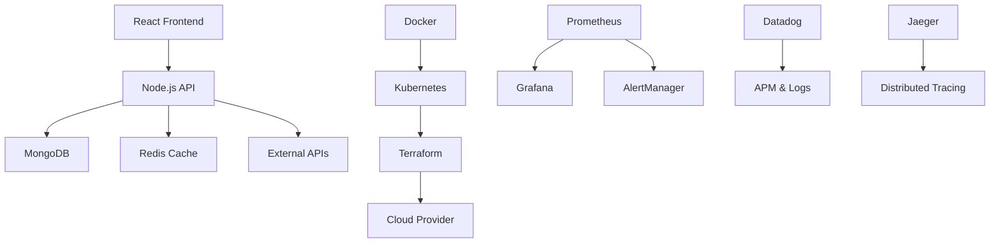

# Healthcare DevOps Pipeline

[](https://jenkins.healthcare-app.com/job/healthcare-devops-pipeline/)
[](https://sonarcloud.io/dashboard?id=healthcare-devops-pipeline)
[](https://sonarcloud.io/dashboard?id=healthcare-devops-pipeline)
[](https://sonarcloud.io/dashboard?id=healthcare-devops-pipeline)

A comprehensive healthcare management system with enterprise-grade DevOps pipeline, implementing all 7 stages of CI/CD with advanced deployment strategies and monitoring.

## Features

### Core Functionality
- **Patient Management**: Complete patient lifecycle management
- **Appointment Scheduling**: Intelligent scheduling with conflict resolution
- **Doctor Management**: Staff scheduling and availability management
- **Medical Records**: Secure electronic health records
- **Real-time Notifications**: WebSocket-based notifications
- **Authentication & Authorization**: JWT-based auth with role-based access

### DevOps Pipeline
- **7-Stage CI/CD**: Complete automation from code to production
- **Blue-Green Deployments**: Zero-downtime releases
- **Canary Releases**: Gradual rollout with automated rollback
- **Advanced Monitoring**: Prometheus, Grafana, Datadog integration
- **Security Scanning**: Multi-layer security analysis
- **Load Testing**: Artillery-based performance testing
- **Chaos Engineering**: Automated resilience testing

### Enterprise Features
- **Multi-environment**: Development, staging, production
- **Infrastructure as Code**: Terraform-based infrastructure
- **Container Orchestration**: Kubernetes with service mesh
- **Monitoring & Alerting**: Comprehensive observability stack
- **Backup & Recovery**: Automated disaster recovery
- **Compliance**: HIPAA, SOC 2, GDPR compliance ready

## Architecture

### System Overview


### Technology Stack

#### Frontend
- **React 18** with TypeScript
- **Material-UI** for components
- **Redux Toolkit** for state management
- **React Router** for navigation
- **Axios** for API calls
- **Socket.io** for real-time features

#### Backend
- **Node.js** with Express.js
- **TypeScript** for type safety
- **MongoDB** with Mongoose ODM
- **Redis** for caching and sessions
- **JWT** for authentication
- **bcrypt** for password hashing

#### DevOps & Infrastructure
- **Docker** for containerization
- **Kubernetes** for orchestration
- **Terraform** for infrastructure as code
- **Jenkins** for CI/CD pipeline
- **Helm** for package management
- **Istio** for service mesh

#### Monitoring & Security
- **Prometheus** for metrics collection
- **Grafana** for visualization
- **Datadog** for APM and logs
- **Jaeger** for distributed tracing
- **SonarQube** for code quality
- **OWASP ZAP** for security testing

## Prerequisites

### System Requirements
- **Node.js**: 18.0.0 or higher
- **Docker**: 20.10.0 or higher
- **Kubernetes**: 1.19.0 or higher
- **Terraform**: 1.0.0 or higher
- **kubectl**: Configured for your cluster

### Development Setup
```bash
# Clone repository
git clone https://github.com/arsh-dang/healthcare-devops-pipeline.git
cd healthcare-devops-pipeline

# Install dependencies
npm install

# Start development environment
docker-compose up -d

# Run application
npm run dev
```

## Deployment

### Quick Start
```bash
# Deploy to staging
./scripts/deploy.sh staging

# Deploy to production
./scripts/deploy.sh production
```

### Blue-Green Deployment
```bash
# Deploy new version to green environment
./scripts/production-deploy.sh production v1.2.3

# Verify deployment
curl https://api.healthcare-app.com/health
```

### Canary Deployment
```bash
# Start canary deployment
kubectl apply -f k8s/canary/

# Monitor canary metrics
kubectl get pods -l environment=canary
```

## Monitoring

### Access Monitoring Interfaces

#### Grafana Dashboards
```bash
kubectl port-forward svc/grafana 3000:3000
# Access: http://localhost:3000
```

#### Prometheus Metrics
```bash
kubectl port-forward svc/prometheus 9090:9090
# Access: http://localhost:9090
```

#### Jaeger Tracing
```bash
kubectl port-forward svc/jaeger 16686:16686
# Access: http://localhost:16686
```

### Key Metrics
- **Application Performance**: Response times, error rates, throughput
- **Infrastructure Health**: CPU, memory, disk usage
- **Business Metrics**: User registrations, appointment bookings
- **Security Events**: Failed authentication attempts, suspicious activities

## Testing

### Run Test Suite
```bash
# Unit tests
npm run test:unit

# Integration tests
npm run test:integration

# End-to-end tests
npm run test:e2e

# Load testing
./scripts/load-testing.sh

# Chaos engineering
./scripts/chaos-engineering.sh
```

### Test Coverage
- **Unit Tests**: 90%+ coverage
- **Integration Tests**: API endpoints and database operations
- **E2E Tests**: Complete user workflows
- **Performance Tests**: Load testing with Artillery
- **Security Tests**: Automated vulnerability scanning

## Security

### Security Features
- **Authentication**: JWT with refresh tokens
- **Authorization**: Role-based access control
- **Data Encryption**: TLS 1.3, AES-256 encryption
- **Security Headers**: OWASP recommended headers
- **Rate Limiting**: API rate limiting and DDoS protection
- **Audit Logging**: Comprehensive security event logging

### Security Scanning
```bash
# Run security scan
./scripts/advanced-security-scan.sh

# View security reports
open security-reports/
```

## API Documentation

### OpenAPI Specification
The API is fully documented using OpenAPI 3.0 specification.

```bash
# Generate API docs
./scripts/generate-docs.sh

# View API documentation
open docs/generated/api/index.html
```

### Key Endpoints

#### Authentication
- `POST /api/auth/login` - User login
- `POST /api/auth/register` - User registration
- `POST /api/auth/refresh` - Refresh access token

#### Patients
- `GET /api/patients` - List patients
- `POST /api/patients` - Create patient
- `GET /api/patients/:id` - Get patient details
- `PUT /api/patients/:id` - Update patient
- `DELETE /api/patients/:id` - Delete patient

#### Appointments
- `GET /api/appointments` - List appointments
- `POST /api/appointments` - Create appointment
- `GET /api/appointments/:id` - Get appointment details
- `PUT /api/appointments/:id` - Update appointment
- `DELETE /api/appointments/:id` - Delete appointment

## Contributing

### Development Workflow
1. **Fork** the repository
2. **Create** a feature branch (`git checkout -b feature/amazing-feature`)
3. **Commit** your changes (`git commit -m 'Add amazing feature'`)
4. **Push** to the branch (`git push origin feature/amazing-feature`)
5. **Open** a Pull Request

### Code Standards
- **ESLint**: JavaScript/TypeScript linting
- **Prettier**: Code formatting
- **Husky**: Git hooks for quality checks
- **Commitizen**: Standardized commit messages

### Testing Requirements
- All new features must include unit tests
- Integration tests for API changes
- E2E tests for user-facing features
- 90%+ code coverage requirement

## License

This project is licensed under the MIT License - see the [LICENSE](LICENSE) file for details.

## Acknowledgments

- **Healthcare Domain Experts**: For medical workflow insights
- **DevOps Community**: For best practices and tools
- **Open Source Contributors**: For amazing tools and libraries
- **Security Researchers**: For vulnerability research and tools

## Support

### Documentation
- [API Documentation](./docs/generated/api/)
- [Deployment Guide](./docs/generated/deployment-guide.md)
- [Architecture Overview](./docs/generated/architecture/)

### Getting Help
- **Issues**: [GitHub Issues](https://github.com/arsh-dang/healthcare-devops-pipeline/issues)
- **Discussions**: [GitHub Discussions](https://github.com/arsh-dang/healthcare-devops-pipeline/discussions)
- **Documentation**: [Wiki](https://github.com/arsh-dang/healthcare-devops-pipeline/wiki)

### Community
- **Slack**: Join our [Slack community](https://healthcare-devops.slack.com)
- **Twitter**: Follow [@HealthcareDevOps](https://twitter.com/HealthcareDevOps)
- **Blog**: [DevOps Blog](https://blog.healthcare-devops.com)

---

**Built with ❤️ for healthcare professionals worldwide**
