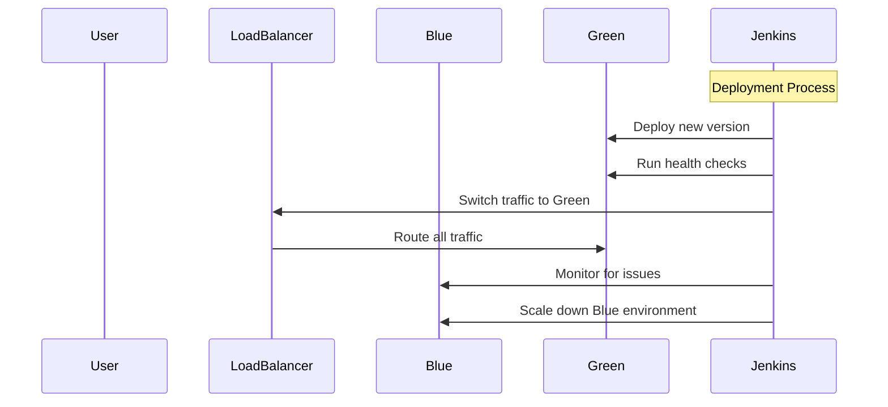
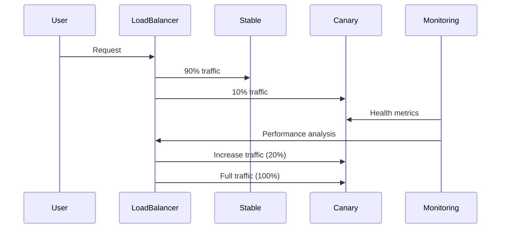

# Deployment Architecture

## Blue-Green Deployment Strategy

### Overview
Blue-green deployment is a technique that reduces downtime and risk by running two identical production environments called Blue and Green.

### Process Flow



### Benefits
- **Zero Downtime**: Traffic switching is instantaneous
- **Instant Rollback**: Switch back to blue if issues detected
- **Risk Reduction**: Test in production-like environment
- **Gradual Rollout**: Can implement canary releases

## Canary Deployment Strategy

### Overview
Canary deployment gradually rolls out changes to a small subset of users before full release.

### Process Flow



### Benefits
- **Risk Mitigation**: Test with real users
- **Performance Validation**: Monitor impact on real traffic
- **Gradual Rollout**: Control exposure to new features
- **Automated Rollback**: Based on metrics thresholds

## Infrastructure Components

### Kubernetes Architecture

```yaml
apiVersion: apps/v1
kind: Deployment
metadata:
  name: healthcare-app
spec:
  replicas: 3
  strategy:
    type: RollingUpdate
    rollingUpdate:
      maxSurge: 1
      maxUnavailable: 0
  template:
    spec:
      containers:
      - name: frontend
        image: healthcare-app-frontend:latest
        resources:
          requests:
            cpu: 100m
            memory: 128Mi
          limits:
            cpu: 500m
            memory: 512Mi
      - name: backend
        image: healthcare-app-backend:latest
        resources:
          requests:
            cpu: 200m
            memory: 256Mi
          limits:
            cpu: 1000m
            memory: 1Gi
```

### Service Mesh Configuration

```yaml
apiVersion: networking.istio.io/v1alpha3
kind: VirtualService
metadata:
  name: healthcare-app
spec:
  http:
  - match:
    - headers:
        x-canary:
          exact: "true"
    route:
    - destination:
        host: healthcare-app-canary
  - route:
    - destination:
        host: healthcare-app-stable
      weight: 90
    - destination:
        host: healthcare-app-canary
      weight: 10
```

### Monitoring Stack

```yaml
apiVersion: monitoring.coreos.com/v1
kind: PrometheusRule
metadata:
  name: healthcare-app-alerts
spec:
  groups:
  - name: healthcare-app
    rules:
    - alert: HighErrorRate
      expr: rate(http_requests_total{status=~"5.."}[5m]) / rate(http_requests_total[5m]) > 0.05
      for: 5m
      labels:
        severity: critical
      annotations:
        summary: "High error rate detected"
        description: "Error rate is {{ $value }}% which is above 5%"
```
