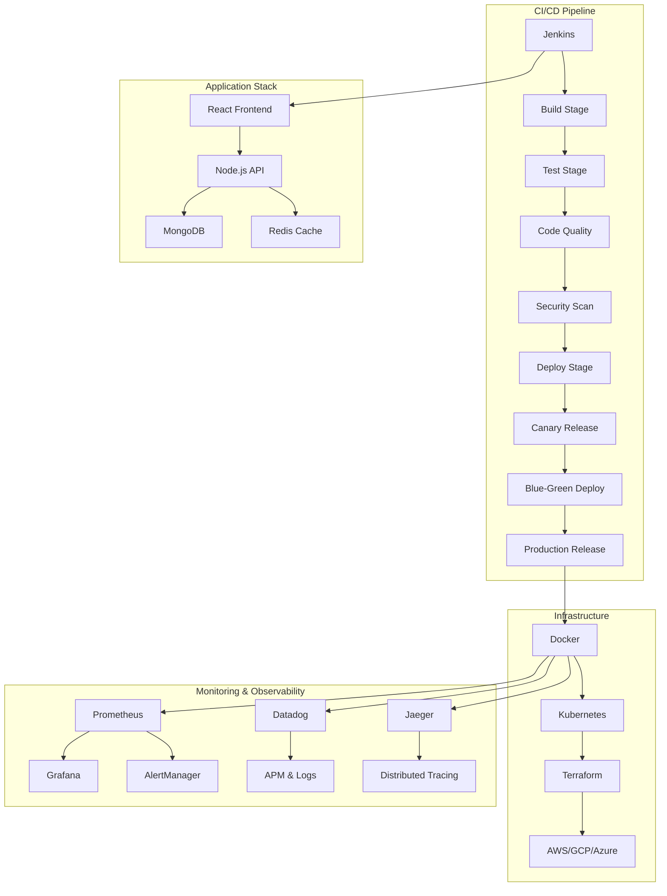

# System Architecture Overview

## Healthcare DevOps Pipeline Architecture

### High-Level Architecture

### Component Details

#### Frontend Layer
- **Technology**: React 18 with TypeScript
- **Features**:
  - Responsive UI with Material-UI
  - Real-time updates with WebSocket
  - PWA capabilities
  - Accessibility compliance (WCAG 2.1 AA)

#### Backend Layer
- **Technology**: Node.js with Express.js
- **Features**:
  - RESTful API design
  - JWT authentication
  - Rate limiting and security middleware
  - Database connection pooling
  - Background job processing

#### Data Layer
- **Primary Database**: MongoDB
- **Caching**: Redis
- **Features**:
  - Data encryption at rest
  - Automated backups
  - Read/write splitting
  - Connection pooling

#### Infrastructure Layer
- **Containerization**: Docker
- **Orchestration**: Kubernetes
- **Infrastructure as Code**: Terraform
- **Cloud Providers**: Multi-cloud support

#### DevOps Pipeline
- **CI/CD**: Jenkins with declarative pipelines
- **Version Control**: Git with GitFlow
- **Artifact Repository**: Docker Registry
- **Configuration Management**: Kubernetes ConfigMaps/Secrets

### Security Architecture

#### Authentication & Authorization
- JWT-based authentication
- Role-based access control (RBAC)
- Multi-factor authentication (MFA)
- Session management with Redis

#### Data Protection
- TLS 1.3 encryption in transit
- AES-256 encryption at rest
- Database field-level encryption
- Secure key management

#### Network Security
- VPC isolation
- Security groups and network ACLs
- Web Application Firewall (WAF)
- DDoS protection

#### Compliance
- HIPAA compliance for healthcare data
- SOC 2 Type II compliance
- GDPR compliance for EU data
- Regular security audits

### Performance Characteristics

#### Response Times
- API endpoints: <200ms average
- Page load: <2s
- Database queries: <50ms

#### Scalability
- Horizontal pod scaling
- Database read replicas
- CDN for static assets
- Auto-scaling based on metrics

#### Availability
- 99.9% uptime SLA
- Multi-zone deployment
- Automated failover
- Disaster recovery procedures

### Monitoring & Alerting

#### Application Metrics
- Request/response metrics
- Error rates and types
- Database connection pools
- Cache hit/miss ratios

#### Infrastructure Metrics
- CPU and memory usage
- Network I/O
- Disk I/O and space
- Container health

#### Business Metrics
- User registration rates
- Appointment booking rates
- System usage patterns
- Performance KPIs

### Deployment Strategy

#### Development Environment
- Local development with Docker Compose
- Hot reloading for frontend/backend
- Automated testing on commits

#### Staging Environment
- Full infrastructure deployment
- Integration testing
- Performance testing
- Security scanning

#### Production Environment
- Blue-green deployments
- Canary releases for high-risk changes
- Automated rollback capabilities
- Comprehensive monitoring

### Disaster Recovery

#### Backup Strategy
- Database backups every 6 hours
- Configuration backups daily
- Application artifacts versioning
- Infrastructure state backups

#### Recovery Procedures
- RTO: 4 hours
- RPO: 1 hour
- Automated failover to secondary region
- Manual intervention for critical incidents

#### Testing
- Regular disaster recovery drills
- Automated failover testing
- Data restoration testing
- Performance validation post-recovery
